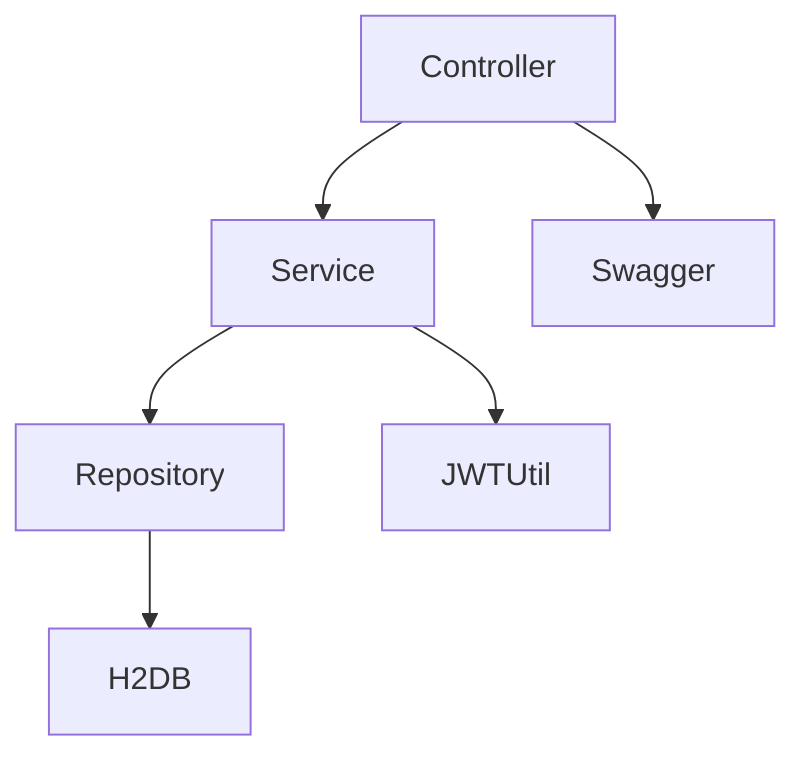

# API RESTful de Usuarios

## Descripción
API desarrollada en Java 17+ con Spring Boot, JPA, H2, JWT y Swagger. Permite la gestión de usuarios con operaciones CRUD, validación de correo y contraseña, y autenticación vía JWT.

---

## Requisitos previos
- Java 17 o superior (probado con Java 21)
- Maven 3.8+

---

## Ejecución
1. **Clona el repositorio y navega a la carpeta del proyecto:**
   ```bash
   git clone <https://github.com/rodrigogalvezpinto/api-gestion-usuarios.git>
   cd <api-gestion-usuarios>
   ```
2. **Compila y ejecuta la aplicación:**
   ```bash
   mvn clean install
   mvn spring-boot:run
   ```
3. **Accede a la documentación Swagger:**
   - [http://localhost:8080/swagger-ui.html](http://localhost:8080/swagger-ui.html)

---

## Endpoints principales
- `POST /api/usuarios` — Crear usuario
- `GET /api/usuarios/{id}` — Obtener usuario por ID
- `GET /api/usuarios` — Listar usuarios
- `PUT /api/usuarios/{id}` — Actualizar usuario
- `PATCH /api/usuarios/{id}` — Actualización parcial
- `DELETE /api/usuarios/{id}` — Eliminar usuario

---

## Formato de request y response
### Ejemplo de request para crear usuario
```json
{
  "nombre": "Juan Rodriguez",
  "correo": "juan@rodriguez.org",
  "contrasena": "Hunter2024",
  "telefonos": [
    {
      "numero": "1234567",
      "codigoCiudad": "1",
      "codigoPais": "57"
    }
  ]
}
```

### Ejemplo de respuesta exitosa
```json
{
  "id": "b1a7c2e0-1234-4c56-8a2b-123456789abc",
  "creado": "2024-06-07T12:00:00",
  "modificado": "2024-06-07T12:00:00",
  "ultimoLogin": "2024-06-07T12:00:00",
  "token": "<JWT>",
  "activo": true,
  "nombre": "Juan Rodriguez",
  "correo": "juan@rodriguez.org",
  "telefonos": [
    {
      "numero": "1234567",
      "codigoCiudad": "1",
      "codigoPais": "57"
    }
  ]
}
```

### Ejemplo de error
```json
{"mensaje": "El correo ya está registrado"}
```

---

## Validaciones
- **Correo:**
  - Debe tener formato válido (ejemplo: `usuario@dominio.com`).
  - Debe ser único en la base de datos.
- **Contraseña:**
  - Debe cumplir la expresión regular configurable en `application.yml`.
  - Por defecto: al menos 6 caracteres (`^.{6,}$`). Puedes cambiarla por una más estricta si lo deseas.
- **Todos los errores** se devuelven en formato JSON: `{ "mensaje": "mensaje de error" }`

---

## Seguridad y JWT
- Al crear un usuario, se genera un **token JWT** que se retorna en el campo `token` de la respuesta.
- El JWT contiene el `id` y el `correo` del usuario y está firmado con una clave secreta interna.
- Puedes usar este token para autenticación en endpoints futuros (por ejemplo, agregando un filtro de seguridad o autenticación personalizada).
- El token se persiste junto con el usuario en la base de datos.

---

## Base de datos y datos de ejemplo
- Se utiliza **H2 en memoria**. Puedes acceder a la consola en [http://localhost:8080/h2-console](http://localhost:8080/h2-console)
  - JDBC URL: `jdbc:h2:mem:usuariosdb`
  - Usuario: `sa` (sin contraseña)
- Al iniciar la app, se precargan usuarios de ejemplo desde `src/main/resources/data.sql`.

---

## Cómo probar la API
1. **Crear usuario:**
   - Usa el endpoint `POST /api/usuarios` con un correo único y una contraseña válida.
2. **Listar usuarios:**
   - Usa `GET /api/usuarios` para ver todos los usuarios registrados.
3. **Obtener usuario por ID:**
   - Usa `GET /api/usuarios/{id}` con el UUID retornado al crear o listar usuarios.
4. **Actualizar usuario:**
   - Usa `PUT` o `PATCH` con el ID y los datos a modificar.
5. **Eliminar usuario:**
   - Usa `DELETE /api/usuarios/{id}`.

---

## Diagrama de la solución


---

## Notas adicionales
- Puedes modificar la expresión regular de la contraseña en `src/main/resources/application.yml` para hacerla más o menos estricta según tus necesidades.
- El sistema está preparado para extender la autenticación JWT a endpoints protegidos si lo requieres.
- El manejo de errores es centralizado y consistente en toda la API.

---

**Desarrollado para evaluación técnica.**
- Developer: Rodrigo Galvez Pinto.
- Email: rodrigogalvezpinto@gmail.com